# Manual de Deploy do Schedula

Este manual tem o objetivo de ensinar a realização do Deploy dos repositórios do Schedula.

## 1.  Microservices (back-end)

        Para realizar o deploy dos microsserviços, a equipe utilizou a plataforma Heroku, para seguir em conformidade com os alunos do semestre passado. Ao entrar no link [Heroku](https://www.heroku.com/), criar uma conta, acessar a página inicial e fazer login.

        A ideia principal será criar o deploy do banco de dados primeiramente, que será utilizado pelo ecossistema dos nossos microsserviços.

1.1. Na página inicial, clicar no botão “new” e em “create new app”.

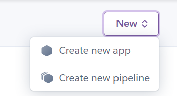

1.2. Ao entrar na opção, preencher o campo app name com algo que remeta ao banco de dados. Esse app será utilizado para hospedar o banco de dados apenas.

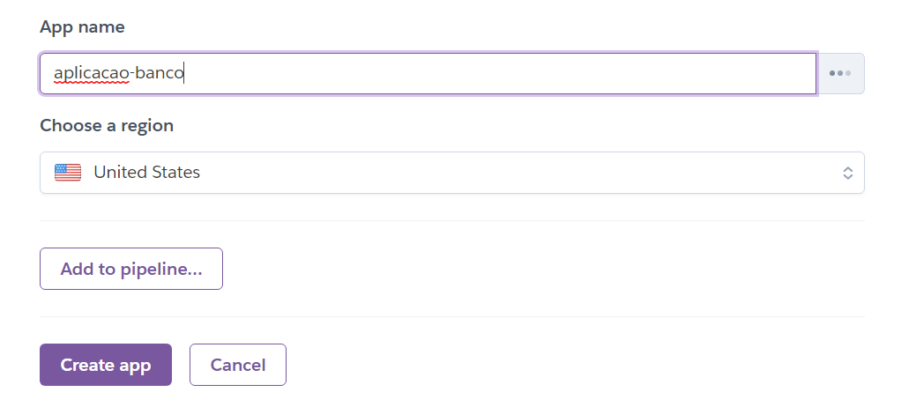

1.3. Ao clicar em “create app”, irá aparecer a seguinte tela. Então, na aba Overview, clicar em “configure add-ons”.

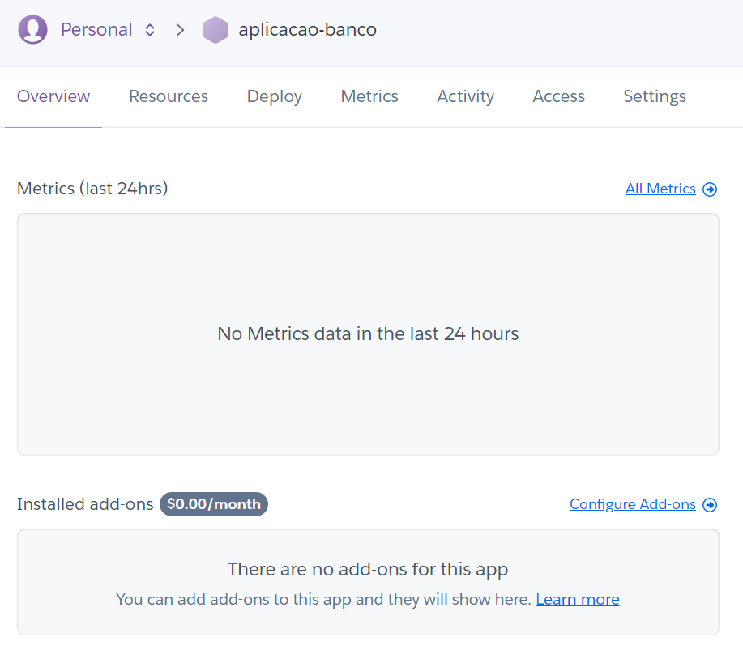

1.4. Nesta tela, pesquisar por Heroku Postgres.

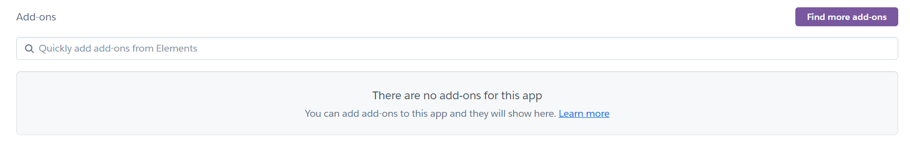

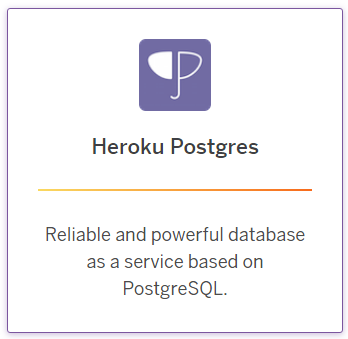

1.5. Após encontrar, clicar em “Install Heroku Postgres”.

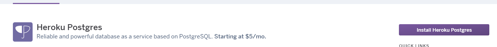

1.6. Selecionar o plano Mini, para o app do banco de dados criado anteriormente. Lembrando que essa é uma opção obrigatoriamente paga.

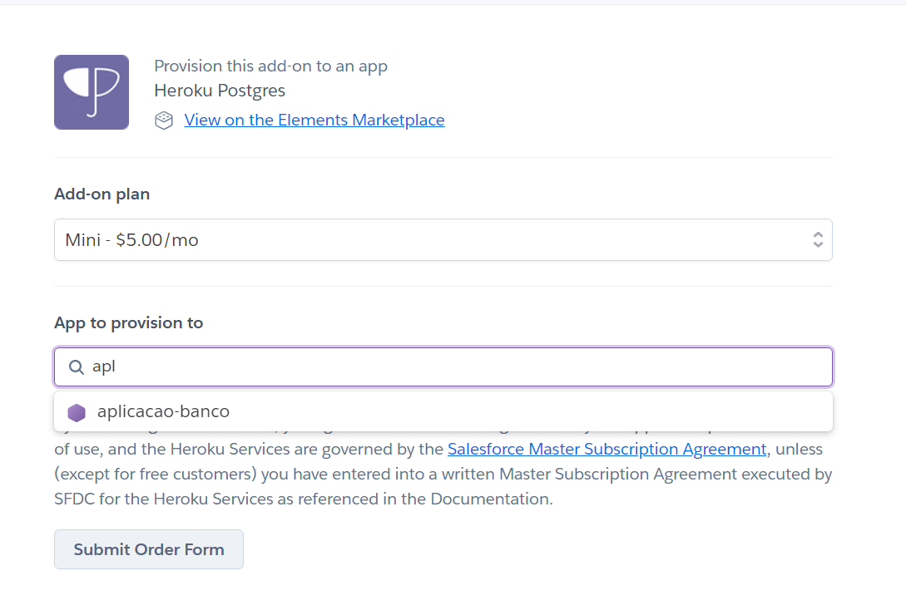

1.7. Ao clicar em “Submit Order Form”, aparecerão opções de pagamento, que serão debitadas ao final do mês.

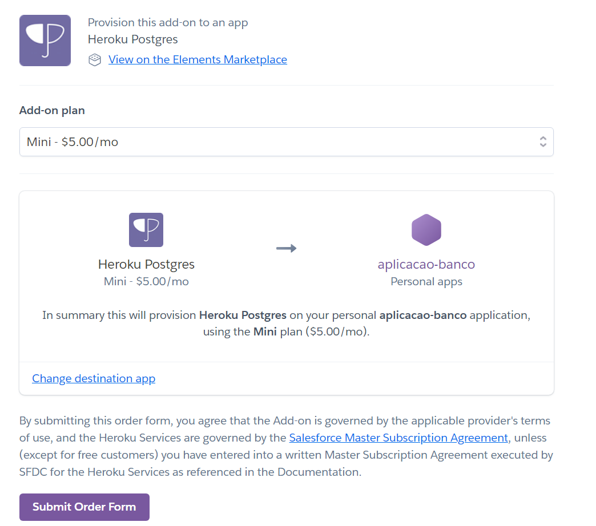

1.8. Depois de realizado esse procedimento, o campo de add-ons instalados deverá estar assim, mostrando o id do banco criado para o nosso ecossistema:

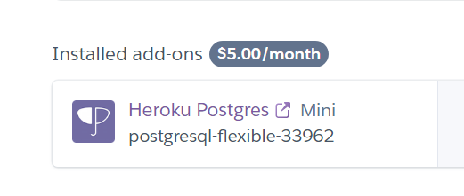

1.9. No campo de Administration, clicar em “view credentials”:

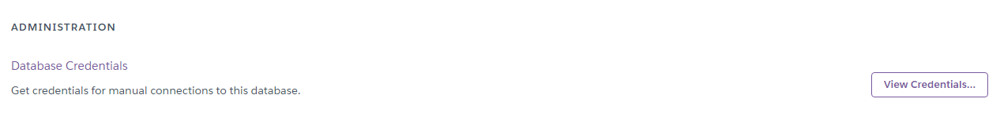

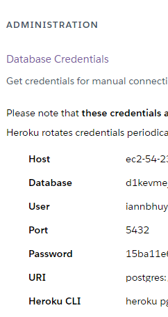

        Essas credenciais são criadas automaticamente depois que o add-on foi instalado com sucesso.

1.10. Com as credenciais criadas, voltar à página inicial do Heroku e criar um novo app. Agora é o momento em que são criados os apps para os três microsserviços do Schedula:

*   Gerenciador de localidades
*   Gestor de usuários
*   Detalhador de chamados

No exemplo abaixo, criamos a partir da página inicial do Heroku um app para armazenar o gerenciador de localidades.

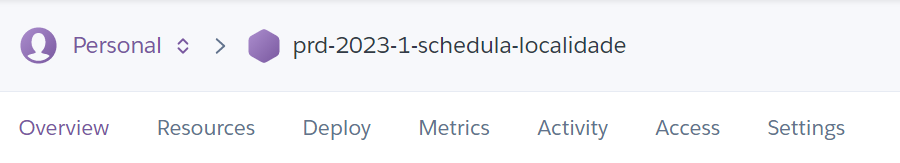

1.11. Clicar em “Reveal Config Vars” e preencher as novas variáveis do banco de dados com valores em conformidade com aquelas criadas no passo 1.9, além de mais duas, “ENVIRONMENT = PRODUCTION” e “NPM\_CONFIG\_PRODUCTION = false”, conforme o guia abaixo.

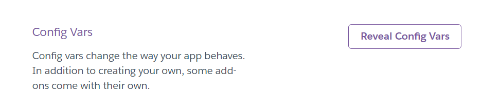

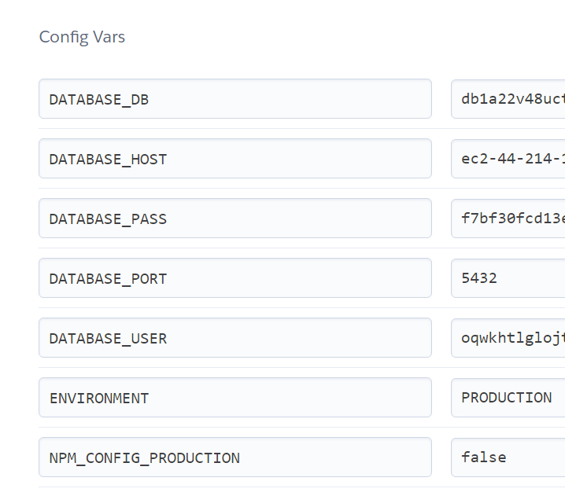

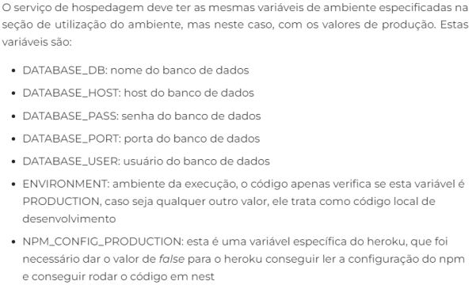

Com as variáveis criadas, o app Heroku está pronto para receber o código fonte desse microsserviço, já estando hábil a realizar as conexões necessárias com o banco de dados.

1.12. Para adicionar o código fonte, vá ao repositório do detalhador de chamados, e em seguida, na aba “settings”, selecionar “security”, “secrets and variables”, “actions” e “New repository secret”.

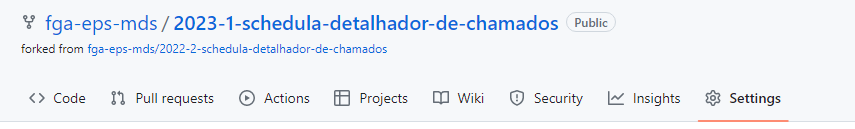

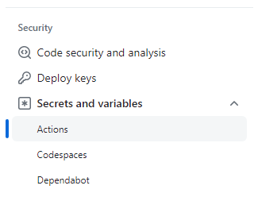

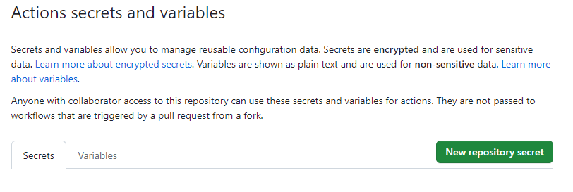

1.13. Adicionar as seguintes variáveis:

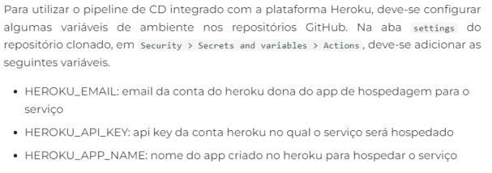

1.14. Retornar ao Heroku, na página do app criado para o detalhador de chamados. Em “deployment method”, selecionar a opção do Github e digitar o nome do repositório do detalhador de chamados. Com ele selecionado, basta finalizar o processo, criando o deploy.

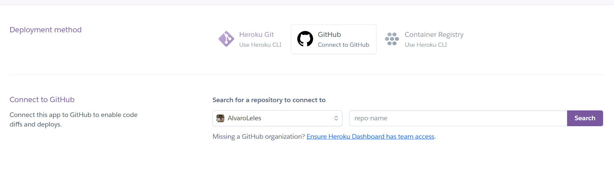

1.15. Esse mesmo processo, dos passos 1.10 ao 1.14, deve ser repetido para o deploy dos outros microsserviços, que estarão em repositórios git diferentes.


## 2.  Front-end


        Embora tenha conseguido realizar o deploy dos repositórios dos microservices no Heroku, equipe teve bastante dificuldade em realizar o deploy do Front-end nessa mesma ferramentas que os alunos de semestres anteriores utilizaram, pois ela tem passado por algumas mudanças e, atualmente, não comporta de maneira razoável aplicações que utilizam o framework Vite, que é usado na aplicação Schedula.

        Dessa maneira, a equipe buscou outras alternativas de servidores cloud para hospedarem o repositório do front-end, e dentre eles, o que melhor se encaixou nas necessidades e limitações da equipe foi o Netlify.

        Assim, segue abaixo um pequeno tutorial com o objetivo de ensinar os leitores a realizarem o mesmo deploy que fizemos do repositório do front-end, lembrando mais uma vez que esses passos só devem ser executados após o deploy de todos os microservices.

2.1. O primeiro passo é acessar o site [Netlify](https://www.netlify.com/) e criar uma conta de usuário, simples e gratuita. É importante preencher todas as informações com a sua conta do Github onde está salvo o repositório do Schedula, para que o Netlify encontre de maneira mais fácil.

2.2. Em seguida, na página inicial, entrar na opção Add new site e Import an existing project.

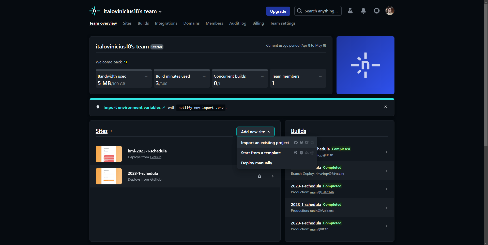

2.3. Ao clicar na opção, selecionar o repositório onde está salvo o código fonte do schedula-front.

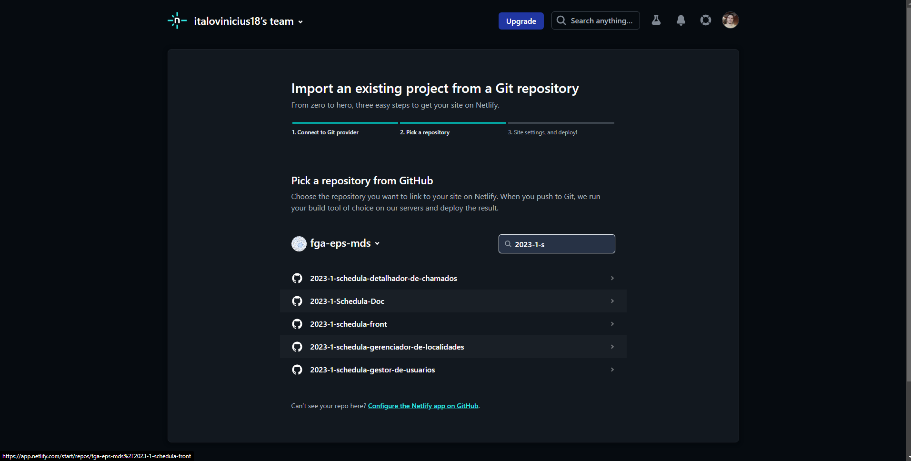

2.4. Configurar da seguinte maneira: selecionar a branch main, o comando de build deve ser “yarn build” e o diretório deve ser “dist”. Clicar no botão “Deploy site”.

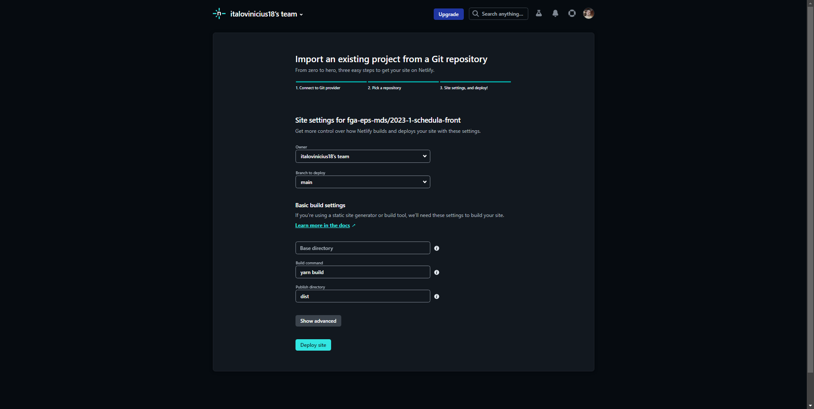

2.5. Você será redirecionado para essa página. O deploy ainda não está concluído, então é necessário fazer algumas configurações, clicando no botão “site settings”.

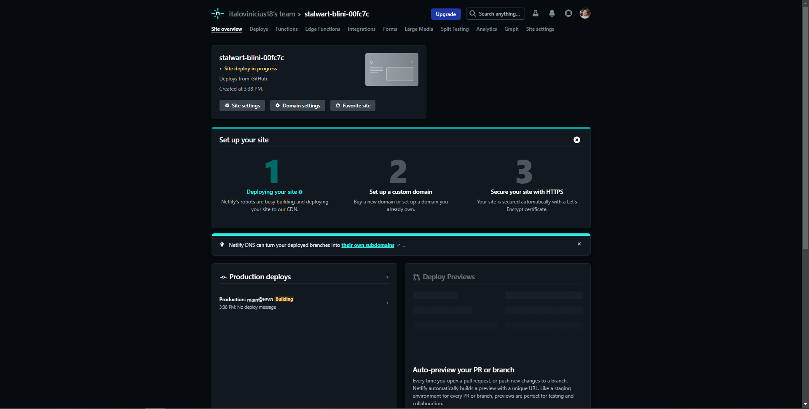

2.6. Na aba de environment variables, colocar no campo “content of .env file” o seguinte:

```
VITE\_PUBLIC\_DETALHADOR\_CHAMADOS\_URL=
VITE\_PUBLIC\_GESTOR\_DE\_USUARIO\_URL=
VITE\_PUBLIC\_GERENCIADOR\_DE\_LOCALIDADES\_URL=
```

        O que deve ser posto após o = de cada variável são os links gerados pelo deploy dos microservices, de maneira similar como colocamos na imagem abaixo para o nosso caso. Manter marcado a opção “all scopes” e “all deploy contents”, e clicar na opção “import variables”.

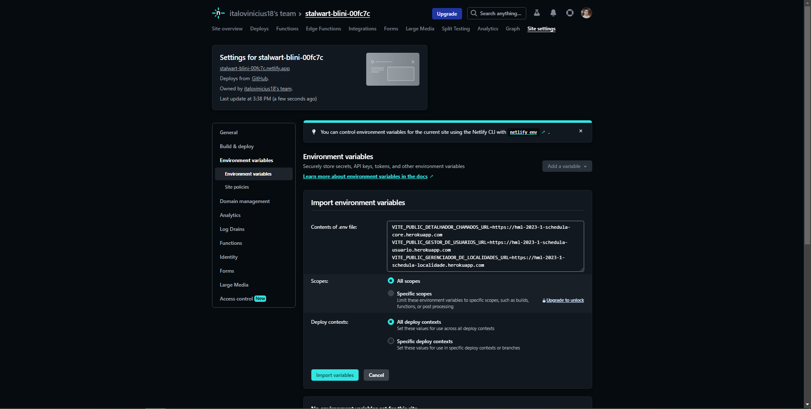

2.7. A sua tela deverá estar assim, o que comprova que as variáveis dos microservices foram registradas com sucesso.

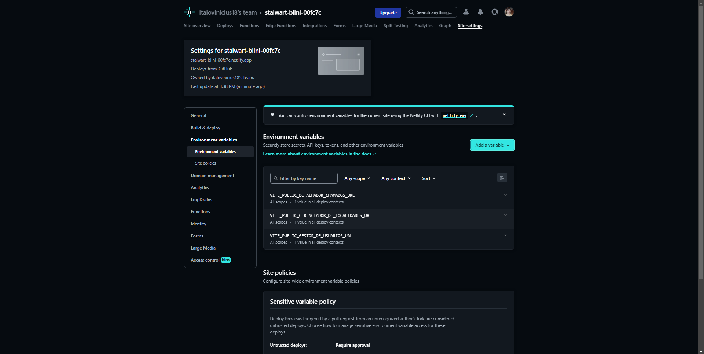

2.8. Ir na opção “domain management” e clicar em “options” > “edit site name” à direita do site gerado por este deploy.  

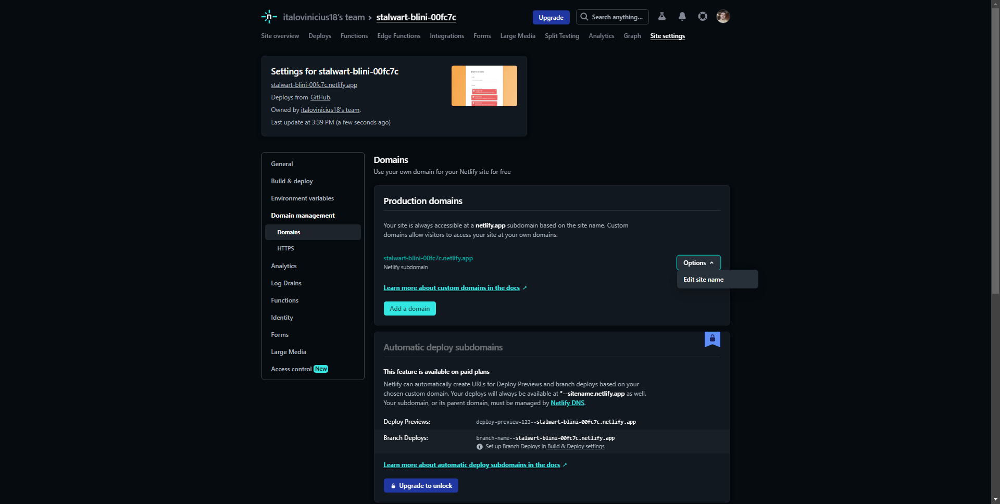

2.9. Abrirá uma opção chamada “change site name”. Nela, você deve colocar o nome desejado para a URL, e clicar em salvar. Lembrando que há o sufixo do Netlify, que não é possível retirar, por ser uma plataforma gratuita.

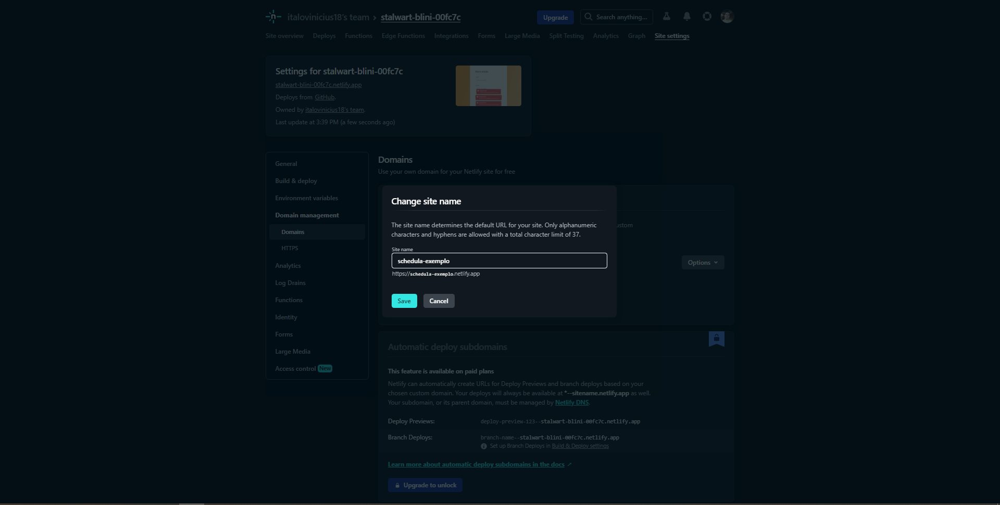

        Ao finalizar, basta acessar o Schedula pela URL gerada após a edição.