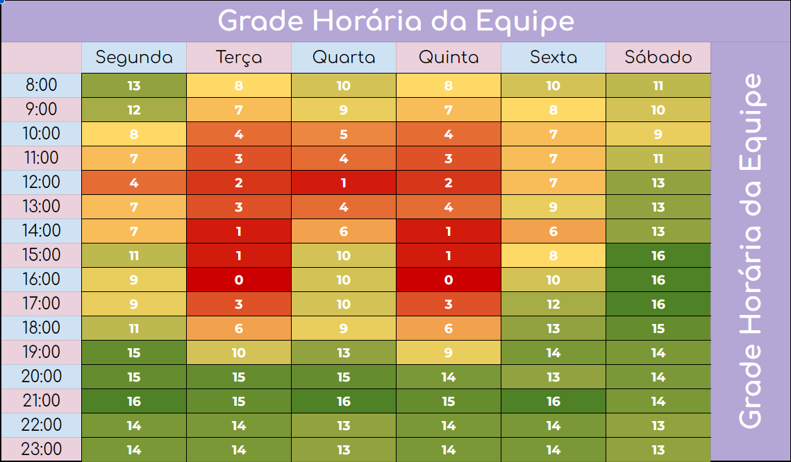

# Planejamento de Comunicação
Este documento tem o objetivo de demonstrar o planejamento de comunicação da equipe, levando em conta suas comunicações internas e externas, sendo elas síncronas ou assíncronas, assim como as ferramentas utilizadas para tal.

## 1. Quadro de disponibilidade

## 2. Reuniões

| Dias | Horário | Reunião |
| :--------: | :--------: | :--------: |
| Quarta    | 19:00 - 20:00 | Reunião com os POs |
| Quarta     | 20:10 - 21:30 | Planning |
| Segunda     | 20:00 - 21:00 | Review / Retrospectiva |
| Segunda à Sexta    | 21:00 | Daily |

## 3. Ferramentas utilizadas

| | Ferramenta | Propósito |
| :--------: | :--------: | :--------: |
|    | Discord | Comunicações assíncronas com os POs e professor / Comunicações e registros de informações internas / Pareamentos |
|    | Whatsapp | Comunicação assíncrona entre o time |
|    | Teams | Reuniões síncronas com os POs e professor / Reuniões internas |
|    | Google Drive | Armazenamento de artefatos |
|    | Github | Repositórios de Documentação e código do projeto |
|   | Zenhub | Ferramenta de acompanhamento do projeto (Kanban, Roadmap, Issues e Sprints) |

## 4. Versionamento

|    Data    | Versão |            Descrição             |      Autor      |
| :--------: | :----: | :------------------------------: | :-------------: |
|  05/05/23  |  1.0   |   Criação do documento e adição dos itens              |   Álvaro Guimarães e Gabriel Avelino  |

