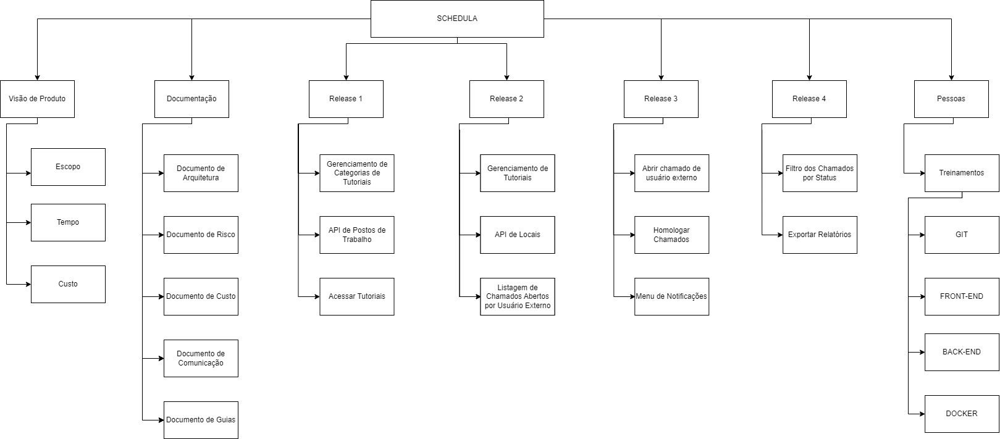

# Estrutura Análitica do Projeto

## 1. Introdução

&emsp;&emsp;
  A Estrutura Análitica do Projeto (EAP) é um diagrama que tem a finalidade de organizar e decompor o escopo do projeto em pequenas partes, facilitando o entendimento e a visualização do projeto como um todo. A EAP é uma ferramenta muito utilizada no gerenciamento de projetos, pois ela permite que tenha uma visão geral do projeto, podendo assim, identificar os principais entregáveis e as atividades necessárias para a conclusão do projeto. A EAP é uma ferramenta que pode ser utilizada em qualquer tipo de projeto, independente do tamanho ou complexidade, pois ela é uma ferramenta simples e de fácil entendimento.

## 2. Metodologia

&emsp;&emsp;
  Esse documento foi elaborado seguindo as diretrizes do plano de ensino da matéria Engenharia do Produto de Software (EPS). Com isso, foram definidas as hierarquias de mais alto nível em cada etapa do projeto, orientando nas entregas de cada fase.

## 3. Resultados

A EAP pode ser vista na imagem abaixo e no link, onde foi confeccionado - no DrawIo. <a href=https://drive.google.com/file/d/1WwrnSu4HhioKrlbuS4KNJfxsjcx7trze/view?usp=sharing>aqui.</a>

## 4. Versionamento

|    Data    | Versão |            Descrição             |      Autor      |
| :--------: | :----: | :------------------------------: | :-------------: |
|  03/05/23  |  1.0   |   Documento inicial              |   Ítalo Serra e Gabriel Bonifácio  |
|  19/05/23  |  2.0   |   Registro da imagem da EAP      |   Ítalo Serra e Gabriel Bonifácio  |

## 5. Referências

> WBS - IBM. Disponível em [https://www.ibm.com/docs/en/mea/761?topic=SSXB7Z_7.6.1/com.ibm.meaora.doc/sag/c_ctr_oraclepa_proj_task_integ.html](https://www.ibm.com/docs/en/mea/761?topic=SSXB7Z_7.6.1/com.ibm.meaora.doc/sag/c_ctr_oraclepa_proj_task_integ.html)

> EAP - Artia. Disponível em [https://artia.com/blog/como-fazer-eap-na-gestao-de-projetos/](https://artia.com/blog/como-fazer-eap-na-gestao-de-projetos/)